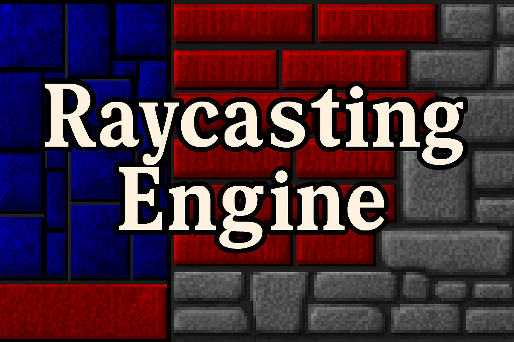
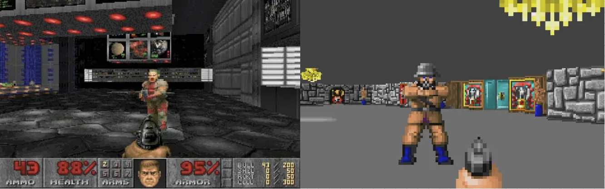
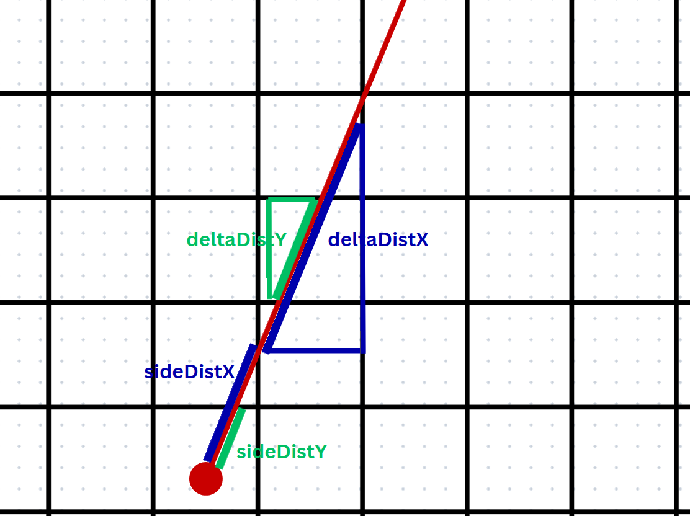
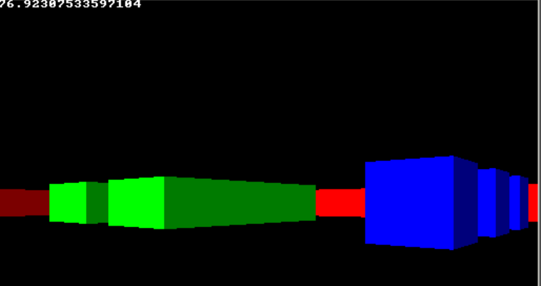
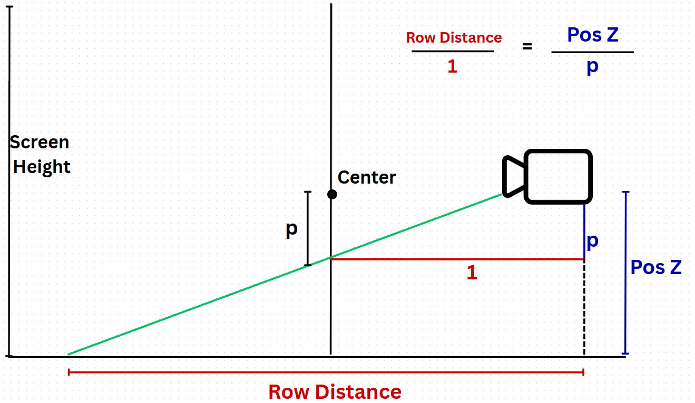
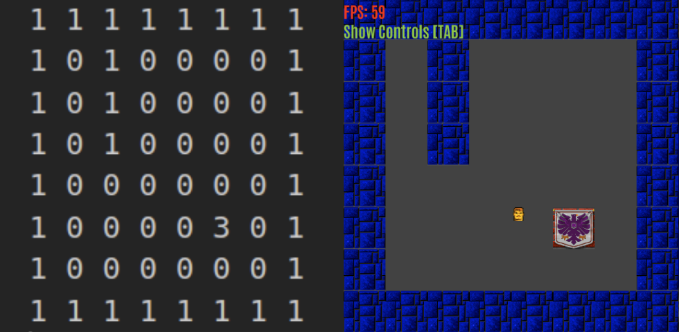
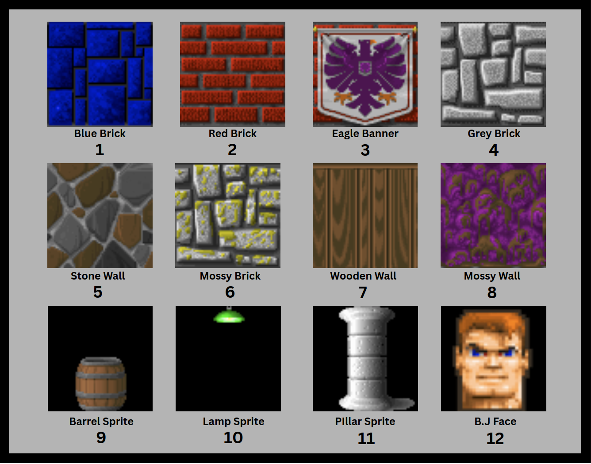

### By Francisco Abreu Gonçalves
***
This algorithm was popularly used in games from the early 90’s such as Wolfenstein 3D and  DOOM, back in the days where the computers were slower and it wasn’t possible to run real 3D engines in realtime.
This project is my implementation of this technique using OpenGL and GLFW, in which I spent time learning the algorithm, as well as having fun trying to recreate the games mentioned above!
***




# THE RAYCASTING IDEA

The main idea is to take a **gridded map** (like an mxn matrix) where colored tiles will be walls (or marked as 1) and place the player somewhere else in this space. **Then the player will “cast” multiple rays inside a sliced region called FOV**. Every ray will travel straight through the gridded map line, from its origin, and will stop whenever it finds a tile with a wall. If the ray position is not in a wall, we have to trace it further: add a certain value to its position, in the direction of the direction of this ray, and for this new position, again check if it's inside a wall or not. Keep doing this until finally a wall is hit.

Instead calculate if every point of the ray hit a wall, we can use a **DDA( Digital Differential Analyzer)** technique that predicts every intersection point to every following cell in the grid using trigonometry relation:

```cpp
// Peforms de DDA
        while(hit == 0) {
            //jump to next map square, either in x-direction, or in y-direction
            if(sideDistX < sideDistY) {

                sideDistX += deltaDistX;
                mapx += stepX; // Moves to the following tile
                side = 0; // It hitted vertically
            }
            else {
                sideDistY += deltaDistY;
                mapy += stepY;
                side = 1;
            }
            
            // THE ORIGINAL COORDINATES ARE FLIPPED, SO THE Y-AXIS IS IN THE TILE DATA WIDTH AND MAPX IN THE TILE DATA HEIGHT
            //Check if ray has hit a wall
            if(Level->tileData[mapy][mapx]) hit = 1; 
        }

```


After the ray was hit, **we can take the length of this ray (distance) and define the wall vertical slice size. It is proportionally inverse to the ray length**, since when further we are from the wall, smaller we see it. This distance can simply be taken by going back one DDA iteration, because the ray is inside the wall. Since the deltaDist are originally scaled using directional vectors, it is already the distance along the camera plane in order to avoid _fisheye_ effect.

```cpp
float deltaDistX = std::abs(1/rayDir.x);
       float deltaDistY = std::abs(1/rayDir.y);


========================================================================
if(side == 0) perpWallDistance = (sideDistX - deltaDistX);  // Goes one step back
       else          perpWallDistance = (sideDistY - deltaDistY);


```

So by rendering each vertical slice computed by each ray, in the end, we can create a fake impression that we are navigating into a 3D environment:




# ADD-ONS

### Texture Handling

This project also binds texture to walls, by mapping in what spot of the Wall in the X-axis the ray hitted it. By getting this information, we can instruct the Fragment shader to only bind a specific texture slice to the quad.

```cpp
#version 330 core
in vec2 TexCoords;
out vec4 color;


uniform sampler2D image;
uniform vec3 spriteColor;
uniform float texXOffset;

void main()
{   
   // Adjusted texture lookup: only sample a vertical slice
   vec2 newTexCoords = vec2(texXOffset, TexCoords.y);
   color = vec4(spriteColor, 1.0) * texture(image, newTexCoords);

}
```

### Floor and Ceiling Casting

I implemented in the project the floor casting algorithm. This technique attempts to render a textured floor and ceiling to the engine. In order to do so, the engine needs to be fed with a matrix map for both of them, alongside the wall map. 
**The idea is, instead of drawing vertical slices, we define the floor texture by casting horizontal rays that sweep from the leftmost spot in the FOV until the rightmost one**. Through this process, we must map half screen down the spots that each ray hits the floor. By triangle equivalence we can achieve this:



The ceiling is the same idea from the floor, but flipped.


### Sprite Casting

The engine also supports sprites rendering. Since its a 2.5D environment, the sprites have 2D coordinates inside the scenario and they scale up based on their distance to the player. For this technique a ZBuffer is needed in order to figure out which sprites are visible to the player. If a sprite happens to be behind a wall or the camera, it is discarded by the fragment shader and will not be rendered.


## Future Improvements
- The engine only works well with one screen resolution (1024 x 512). The ZBuffer is passed as an uniform vector for the fragment shader, in which cannot be reallocated dynamically.
- The sprites do not have collision detection. I would be great use the _isSolid_ atrribute from the _gameObject_ to classify which spites can take a hitBox.
- It would be nice to add a main menu interface so it would be easier and nicer to the user configure its own maps.

---

# Engine Manual

In this section, I explain the steps and further instructions of how to run the engine and create your own scenarios inside it.

### Scenario Building

This engine requires **4 text files** to work. Each of them specifies the map environment:

- **Wall file** : A file with which informs the postion of the walls in the map. It is considered as an mxn matrix:

```
When:

matrix[m][n] > 0 => There is a wall in the mxn coordinate
matrix[m][n] = 0 => There is no wall in the mxn coordinate
```

Here is an example:



- **Floor file**: A file which informs the floor texture from each coordinate in a mxn matrix. The value from each position **MUST BE:**

```
0 < matrix[m][n] <= Number of textures avaiable 
```

-- **Ceiling file**: The same as the floor file but for the ceiling textures.

- **Sprite file**: A file which informs the player initial position, as well as, the other sprites position. The first line is **ALWAYS** the player position. Thus this file requires at least one coordinate. 
Its structure is the following:

```
4 5 -> Players X and Y coordinate in the map
5 3 11 -> First sprite X and Y coordinate in the map + texture number
5 2 11 -> Second sprite X and Y coordinate in the map + texture number
...
```
> **IMPORTANT**: The file _wall_ _file_, _floor_ _file_ and _ceiling_ _file_  **MUST HAVE** the same *matrix size*

### Textures

You can add as much textures for your engine as you want. For this, you simply go to the *Textures Folder* from this project and drop them there, so they will be included in the engine.
> **IMPORTANT**: The texture file name must be a number. This number will the texture's number, which you can reference it in the maps files. Thus, avoid skipping numbers inside the folder.

> **TIP**: For a better retro experience, insert 64x64 pixels images! ;)

By default, the engine comes to the following textures with its reference numbers:




### How to run

This engine uses OpenGL library with GLFW, so if you do not have them installed, run the following commands on your terminal:

```shell
sudo apt update
sudo apt install build-essential pkg-config \
    libglfw3-dev libfreetype6-dev libglew-dev libx11-dev libxcursor-dev libxrandr-dev libxi-dev
```

Once installed, you can compile and run the engine by the MAKEFILE. You simply run the following command:

```shell
make run ARGS= "<Wall_File_path> <Floor_File_path> <Ceiling_File_path> <Sprite_File_path>"
```
***
### References
>Lode Vandevenne: https://lodev.org/cgtutor/raycasting.html

>Learn OpenGL: https://learnopengl.com/
